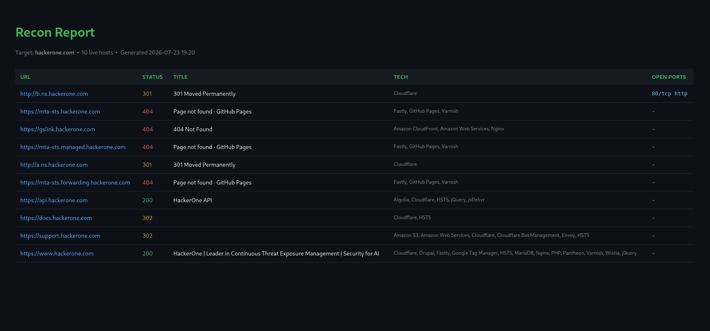

# Recon Automation Tool

A Python CLI that chains subdomain enumeration, live-host probing, port scanning, and reporting into a single automated reconnaissance workflow. Point it at a domain, walk away, get a clean HTML report.

## What it does

Given a target domain, the tool runs a four-stage pipeline:

1. **Subdomain enumeration** — `subfinder` pulls subdomains from passive sources
2. **Live host probing** — `httpx` identifies which hosts respond, capturing status codes, page titles, and technology fingerprints
3. **Port scanning** — `nmap` scans the top 100 ports on each live host
4. **Reporting** — results are rendered into a single dark-themed HTML report

Each stage feeds structured data to the next, collapsing an hour of manual tool-juggling into one command.

## Usage

    python3 main.py example.com

Output is written to `reports/<domain>_<timestamp>.html`.

## Authorization

Subdomain enumeration and host probing are passive. **Port scanning is active and must only be run against assets you own or are explicitly authorized to test** (e.g. a bug bounty scope that permits it, or your own infrastructure). 

## Requirements

- Python 3.10+
- `subfinder`, `httpx` (ProjectDiscovery), `nmap`
- Python packages: `typer`, `jinja2` (see `requirements.txt`)

## Install

    git clone https://github.com/yourname/recon-tool.git
    cd recon-tool
    python3 -m venv venv && source venv/bin/activate
    pip install -r requirements.txt

## Architecture

    recon/
      subdomains.py   # subfinder wrapper
      probe.py        # httpx wrapper, structured output
      portscan.py     # nmap wrapper, port parsing
      report.py       # Jinja2 HTML report generation
    main.py           # CLI entry point, pipeline orchestration

